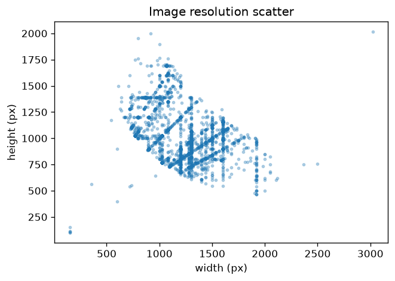
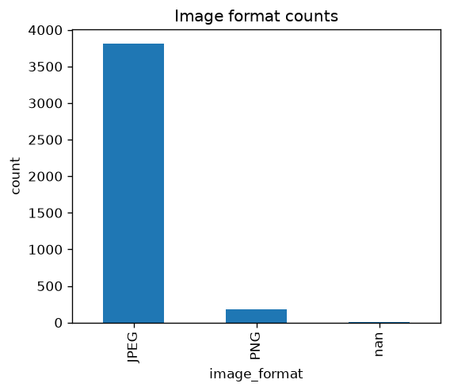
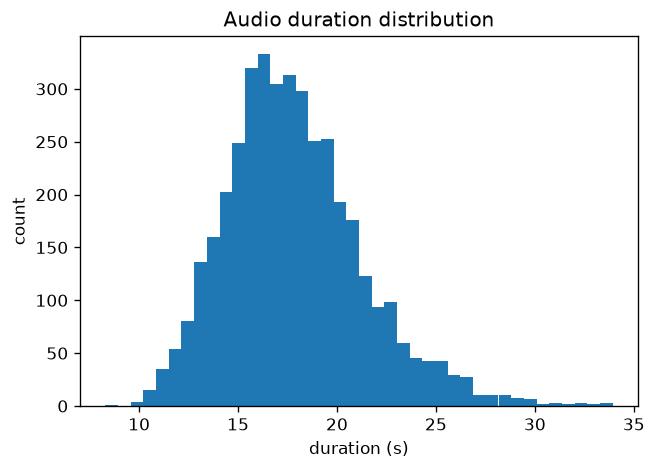
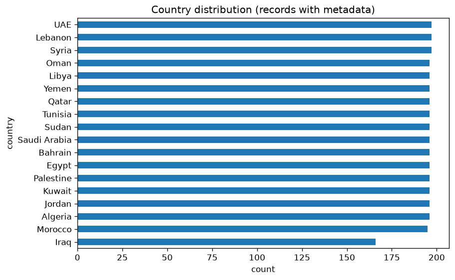

# M0 Data Audit Report

Total records audited: **4000**

## Records per split/language
| split   | language   |   n_records |
|:--------|:-----------|------------:|
| dev     | msa        |         500 |
| devtest | msa        |         500 |
| train   | msa        |        3000 |

## Media integrity
- Missing images: **0**
- Missing audio: **0**
- Present-but-unreadable images: **3**
- Present-but-unreadable audio: **0**

### JSONL parse errors by split
- `train_msa`: 0
- `dev_msa`: 0
- `devtest_msa`: 0

## Image statistics
- Formats: `{'JPEG': 3816, 'PNG': 181, 'nan': 3}`
- Animated GIFs: 0

## Audio statistics
- Sample rates: `{'24000': 4000}`
- Channels: `{'1': 4000}`
- Duration (s): mean=17.86, median=17.48, min=8.30, max=33.93

## Label / country / category distribution
- Labels: `{'2': 1196, '1': 1167, '0': 1137, '<NA>': 500}`

## Duplicate images
- Exact byte-identical duplicate pairs: **0**
- Near-duplicate pairs (perceptual hash): **3**
- Full list: `duplicate_images.csv`

## Random sample

## Raw data
- `file_manifest.csv` -- one row per record with every stat computed above
- `duplicate_images.csv` -- every exact/near duplicate pair found
- `audit_summary.json` -- this report's numbers as machine-readable JSON